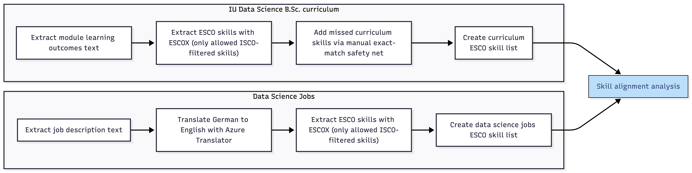

# ESCO-based Skill Alignment Pipeline for Data Science Curriculum Analysis

This repository contains the prototype pipeline and selected research artifacts developed for a master thesis on skill alignment between higher education curricula and labour-market demand in Germany.

The project compares skill demand from German online job advertisements with skill supply from the IU Internationale Hochschule B.Sc. Data Science curriculum. Both sources are mapped into a shared ESCO-based skill space using ESCOX, allowing curriculum and labour-market texts to be compared at the level of standardized ESCO skill concepts.

## High-Level Pipeline Overview

The following figure shows the high-level structure of the thesis pipeline, from input data preparation to ESCO-based skill extraction, enrichment, filtering, and final alignment analysis.

## Project Purpose

The aim of this repository is to document the methodological workflow used in the thesis and to support transparency and partial reproducibility of the analysis.

The pipeline was developed as a research prototype, not as production-ready software. It prioritizes traceability of methodological decisions, reproducibility of thesis results, and clarity of the analytical process over general-purpose software engineering quality.

## Research Context

The thesis investigates how well the skills represented in a data science curriculum align with skills demanded in online job advertisements. The analysis focuses on:

- extracting skills from job advertisements and curriculum module descriptions,
- mapping extracted skills to ESCO skill concepts,
- restricting the skill space to data-science-related occupational areas using ISCO-based ESCO occupation-skill relations,
- comparing job-side and curriculum-side skill patterns,
- evaluating the robustness and plausibility of the extraction pipeline.

The pipeline uses ESCOX for NLP-based ESCO skill extraction and applies additional rule-based logic where required for the thesis design.

## Research Artifacts and Outputs

This repository includes selected processed output files used in the thesis analysis. These files are included intentionally to support transparency, result traceability, and partial reproducibility of the reported findings.

The outputs should be understood as research artifacts rather than software build artifacts. They document the intermediate and final datasets used for the thesis results. Raw job advertisement texts are not redistributed where legal, privacy, or terms-of-use restrictions may apply.

Unlike a typical software repository, this repository intentionally includes selected Excel outputs and processed result files. They are part of the thesis documentation and allow readers to inspect the data transformations and analysis results without rerunning the full pipeline.

### Excluded Raw Data

The following raw or intermediate job advertisement files are intentionally excluded from the public repository:

- `data/jobs.xlsx`
- `data/threshold analysis/threshold analysis jobs.xlsx`

These files contain raw or near-raw job advertisement data and are not redistributed due to potential copyright, terms-of-use, and privacy considerations. The repository instead includes selected processed outputs and aggregated result artifacts used in the thesis analysis.

## License

This repository is licensed under the MIT License.

The license applies only to code and original materials authored for this project. Third-party data, ESCO resources, curriculum materials, and job advertisement content remain subject to their respective licenses, terms of use, and access conditions.